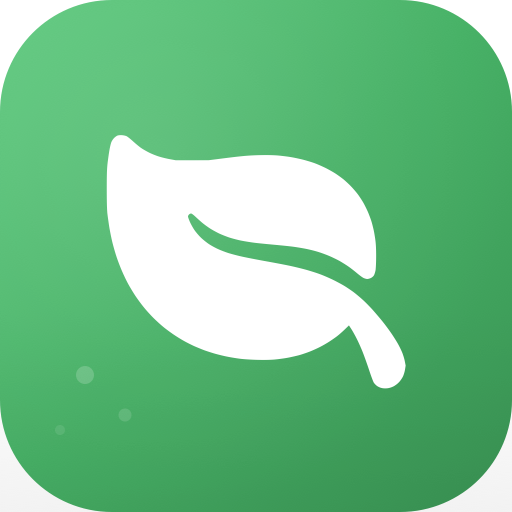

<p align="center">
  
  <p align="center">CleanMac</p>
  <p align="center">macOS 菜单栏清理工具</p>
</p>

## 功能

- 🧹 一键清理系统缓存、日志、临时文件
- 📊 实时显示磁盘可清理空间
- 🎯 支持选择性清理特定项目
- 🚀 轻量级菜单栏应用，无后台运行

## 安装

### 下载安装

从 [Releases](https://github.com/vainjs/clean-mac/releases) 下载最新版本的 DMG 文件。

挂载 DMG 后，将 `CleanMac.app` 拖入 `Applications` 文件夹。

### 首次打开

由于应用未经 Apple 公证，首次打开时系统会提示"无法验证开发者"。

解决方法：

1. 打开 **系统设置** → **隐私与安全性**
2. 找到 "已阻止 CleanMac 以保护 Mac" 提示
3. 点击 **仍要打开**
4. 在弹出的对话框中确认打开

或者使用命令行：

```bash
xattr -cr /Applications/CleanMac.app
```

## 开发

### 环境要求

- Xcode 15+
- XcodeGen

### 构建

```bash
# 安装 XcodeGen
brew install xcodegen

# 生成项目
cd src && xcodegen generate

# 构建
xcodebuild -project CleanMac.xcodeproj -scheme CleanMac -configuration Debug build
```

### 运行

打开 `src/CleanMac.xcodeproj` 在 Xcode 中运行，或直接运行构建产物。

## License

MIT
